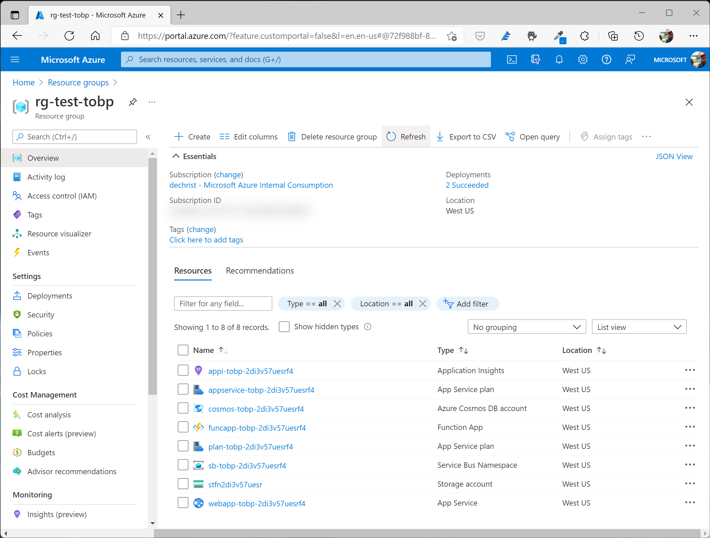
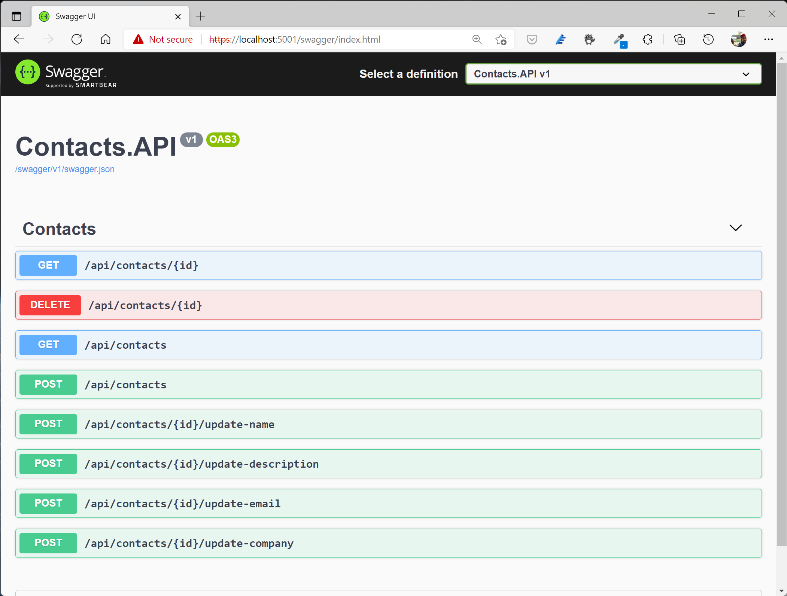
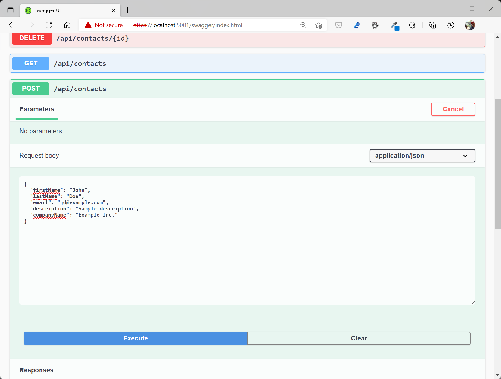
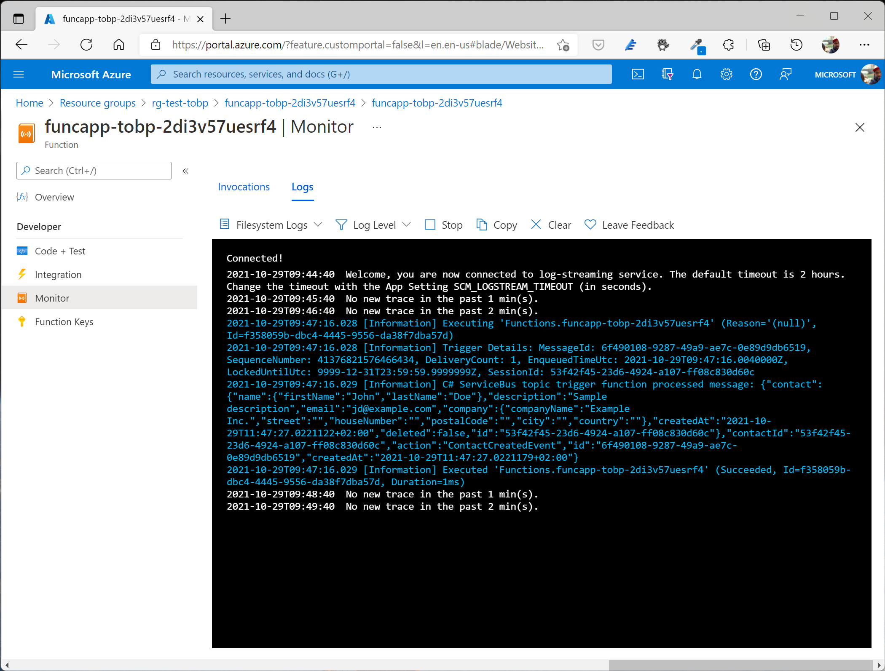
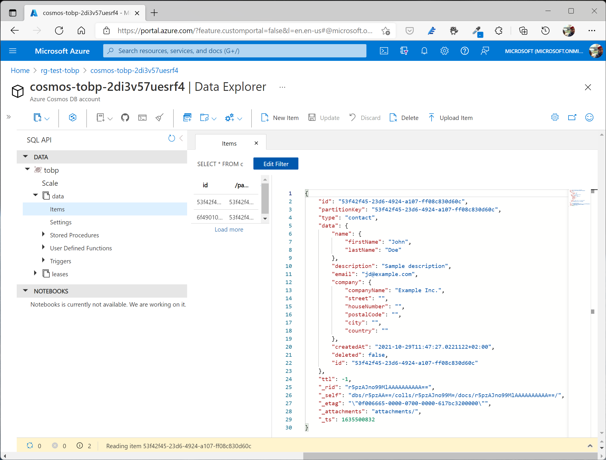

# Sample implementation of the Transactional Outbox Pattern with Cosmos DB

This sample application consists of a "Contacts" API and an event processor that reads a Cosmos DB Change Feed and publishes domain events to an Azure Service Bus. The sample demonstrates how to use the **Transactional Outbox Pattern** in combination with **Azure Cosmos DB** to implement **reliable/guaranteed messaging** in your microservice-oriented application.

The source code is structured as follows:

- **Contacts.Domain** - Contact domain logic and interfaces
- **Contacts.Infrastructure** - Implementation of domain interfaces like repositories
- **Contacts.Application** - Implementation of CQRS pattern using MediatR library, validation and mapping logic
- **Contacts.API** - RESTful API consuming application logic components
- **Contacts.EventsProcessor** - Console application using the Change Feed Processor library to read the Cosmos DB change feed and publish domain events to Azure Service Bus

## Prerequisites

To run the sample application on your local machine, you need to have the following components installed:

- [.NET Core 6.0 SDK](https://dotnet.microsoft.com/download/dotnet/6.0)
- [Visual Studio Code](https://code.visualstudio.com/download)

You also need to create some Azure resources:

- Azure Cosmos DB
- Azure Service Bus
- Azure Function (to test event distribution via Service Bus - acts as a subscriber)

You can find a bicep file that will take care of creating these resources (and their dependencies) under [Deployment/deploy.bicep](Deployment/deploy.bicep).

To run the deployment script, open an [Azure Cloud Shell](https://shell.azure.com), clone this repository to your environment, switch **to the `Deployment` folder** and run:

```shell
export RESOURCE_GROUP=<resource-group-name> # name for your resource group
export LOCATION=<azure-region> # Azure region, for example westeurope, westus etc.

az group create -n $RESOURCE_GROUP -l $LOCATION

az deployment group create -f deploy.bicep -g $RESOURCE_GROUP -o none

az deployment group show -g $RESOURCE_GROUP -n deploy --query properties.outputs
```

The last command will output the relevant parameters that you need to replace in the following files:

- [Contacts.API/appsettings.json](Contacts.API/appsettings.json)
- [Contacts.EventsProcessor/appsettings.json](Contacts.EventsProcessor/appsettings.json)

Your Azure resource group should look like this:



## Run the API and Events Processor locally

After adjusting the appsettings parameters, you can run the `Contacts.API` and `Contacts.EventProcessor` applications on your machine.

> If you are using VS Code, there are predefined debug configurations to build and execute both projects. Just go to the "Debug" view and run both configurations.

When the API and the events processor console app are running, you can open a browser at https://localhost:5001/swagger/index.html (serving the Swagger UI).



To test the flow, you can use the Swagger UI to create a new contact. Use the **POST /api/contacts** operation, fill out the request body and execute the operation.



Alternatively, you can also issue a request via `curl`:

```shell
curl -k -X POST "https://localhost:5001/api/contacts" -H  "accept: */*" -H  "Content-Type: application/json" -d "{\"firstName\":\"John\",\"lastName\":\"Doe\",\"email\":\"jd@example.com\",\"description\":\"Sample description\",\"companyName\":\"Example Inc.\"}"
```

As soon as you add (or later update) contacts, you'll see events being published to the Azure ServiceBus topic and picked up by the Azure Function.



When you look at the Cosmos DB container, you'll find two documents for the create operation (a `Contact` object and the corresponding domain event):



> **Tip**: The Time-To-Live attribute for event documents is currently set to `36000` seconds. That means those documents will be deleted automatically after 10 hours. If you want to adjust the parameter to see how the documents will be cleaned up, go to [Contacts.API/appsettings.json](Contacts.API/appsettings.json) file and set a lower value for `Events.Ttl` (e.g. `120` seconds).

## Clean-Up

To clean-up the Azure resources, use the following command:

```shell
az group delete -n $RESOURCE_GROUP
```
